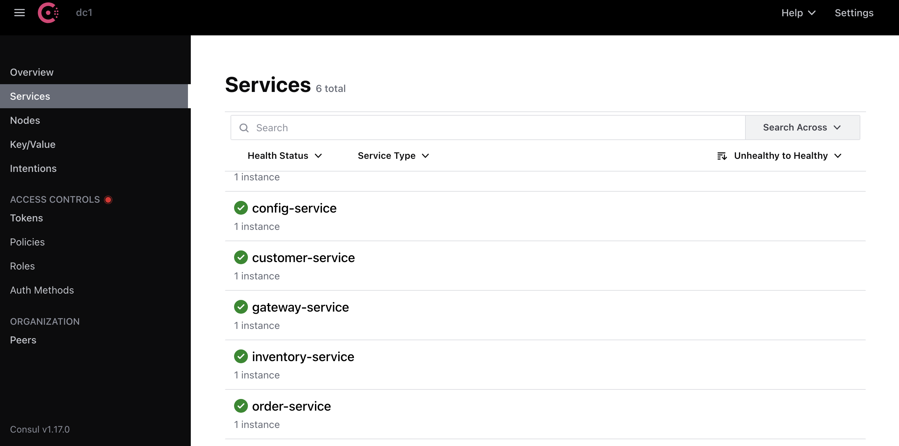
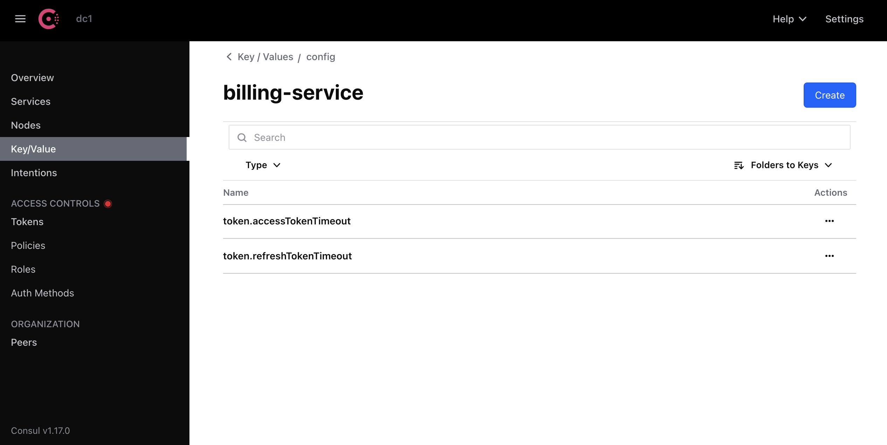
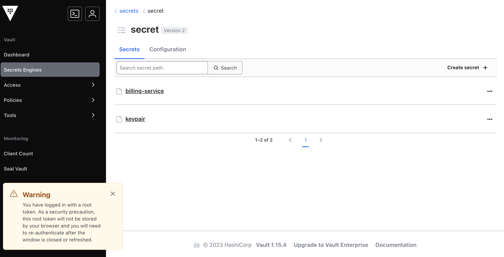

**Microservices-based Invoice Management Application

This project aims to create an application based on a microservices architecture for managing invoices that contain products and belong to a specific client. The following steps outline the implementation:

Customer Service Microservice: Create the microservice responsible for managing clients

Inventory Service Microservice: Develop the microservice responsible for managing products.

Spring Cloud Gateway: Establish the Spring Cloud Gateway to act as a gateway for routing requests.

Static Configuration of Routing System: Configure the system for static routing to manage the flow of requests.

Eureka Discovery Service: Implement the Eureka Discovery Service to serve as a directory for service registration and discovery.

Dynamic Gateway Route Configuration: Enable dynamic configuration of routes within the gateway for flexibility.

Billing Service Microservice with OpenFeign: Create the Billing Service microservice utilizing OpenFeign for service-to-service communication.

Angular Web Client: Develop an Angular-based web client to interact with the created microservices, including functionalities for managing clients, products, and invoices.

Microservices enregistré dans consul

 

TOKEN in consul

 

Toekn in vault

 

